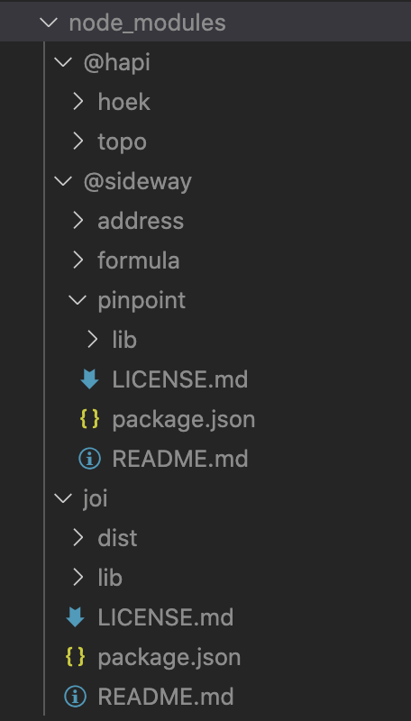
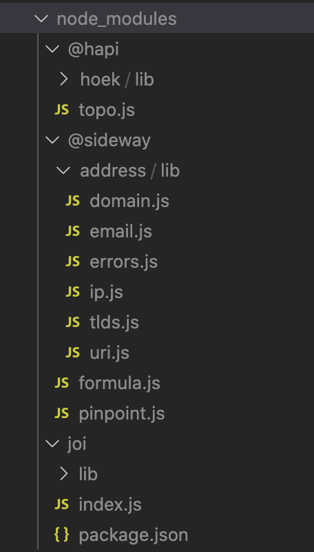

# npm-dist
> Trim node_modules, copy to dist/node_modules, smaller and faster than before, for server side

## Installation

Install via `npm`:

```
$ npm i npm-dist
```

## Usage

``` js
const Trim = require('npm-dist')

// Installed joi@17.3.0
// total 109 files, 905kb
Trim('joi')  // 64 file 504kb
```

Trim(pkgName[, distPath])

| field | required | desc |
| ----- |:--------:| ---- |
| pkgName | true | String, 'joi' |
| distPath | false | String, default is 'dist' |
| returns || - |
| throws || Error |

## Rules

1. Delete package.json, pkg.main is no longer needed
2. Save only reference files
3. When there is only one file, move the package to the root directory

 

## Authors

**Yanglin** ([i@yangl.in](mailto:mail@yanglin.me))


## License

Copyright (c) 2020 Yanglin

Released under the MIT license
